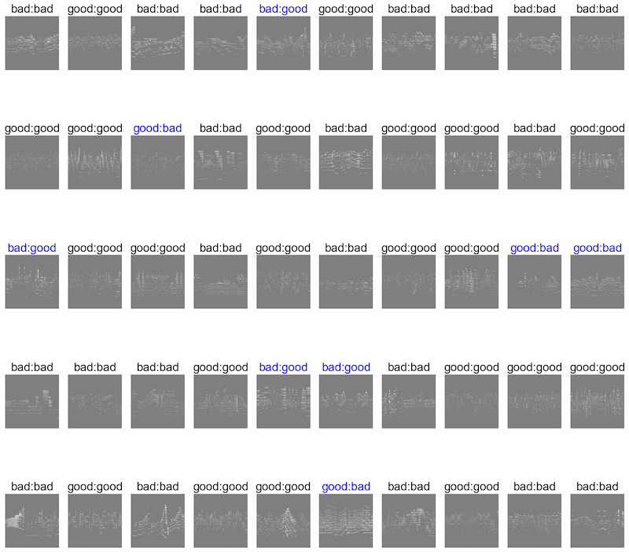

Music Classification Based on Long-term Form

# Motivation 
A successful piece of music requires skillful ordering of diverse musical components. The recent development of sound synthesis technology and music generation algorithms has provided inspirational methods for generating components of music including melody, harmony, and timbre. Computational generation of an entire piece with a long-term musical narrative, however, has remained a challenge and a frequently neglected aspect of algorithmic music generation.

# What This Project Does
This project presents an experimental music classifier to classify two midi datasets: real classical compositions (labelled "good") and random 1-2-minute segments of them ("labelled "bad"). This labelling method is due to the belief that segmented pieces of music do not present long-term musical consistency while complete real compositions do.

The images below show midi clips with ground truth labels.


The project built a model that classifies these images at approximately 85% accuracy. (Blue lables show)


# How to use pretrained model?
* pretrained models are available. to use use 
```python
import torch
torch.

fc feature層の付け替えに関する記述。
```

# How to train your own model?
* only for piano midi. prefarably performance midi
* `git clone`
* `put raw-midi-data`, if place any midi files that you want to classifiy as "good" to the "good" folder. Place anything you want to classify as "bad" to "bad" folder.
* run src step2_2_midi2img_without_image_preprocessing.py to convert midi files into 


# What to come next?
The work is in progress. Now that that a classifier based on the success of musical form is here, the next step is to built a music generator whose outcomes can convince the classifier of its musical consistency.